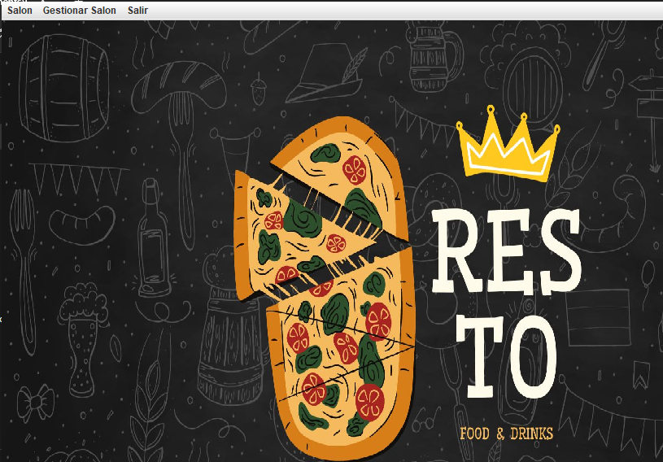

# Sistema de Gestión para Bares

Este software ha sido desarrollado utilizando NetBeans como entorno de desarrollo integrado (IDE) y JDK 17 como plataforma Java. Está diseñado específicamente para la gestión integral de bares, facilitando la administración de operaciones diarias, inventarios, pedidos y otros procesos clave. Este proyecto final fue presentado en la Universidad de La Punta (ULP) como parte del trayecto de un curso de Full Stack en Java.

### Tecnologías utilizadas:

- **Java (JDK 17): Lenguaje de programación principal.
- **NetBeans IDE: Herramienta utilizada para el desarrollo.
- **Java Ant: Utilizado para automatizar el proceso de compilación.
- **JDBC (Java Database Connectivity): Utilizado para la conexión con la base de datos.
  
### Capturas de pantalla

#### Pantalla Login

#### Pantalla de inicio

#### Pantalla de esta de mesas

### Funcionalidades
- Estado de mesas
- Administración de pedidos
- Reportes detallados
